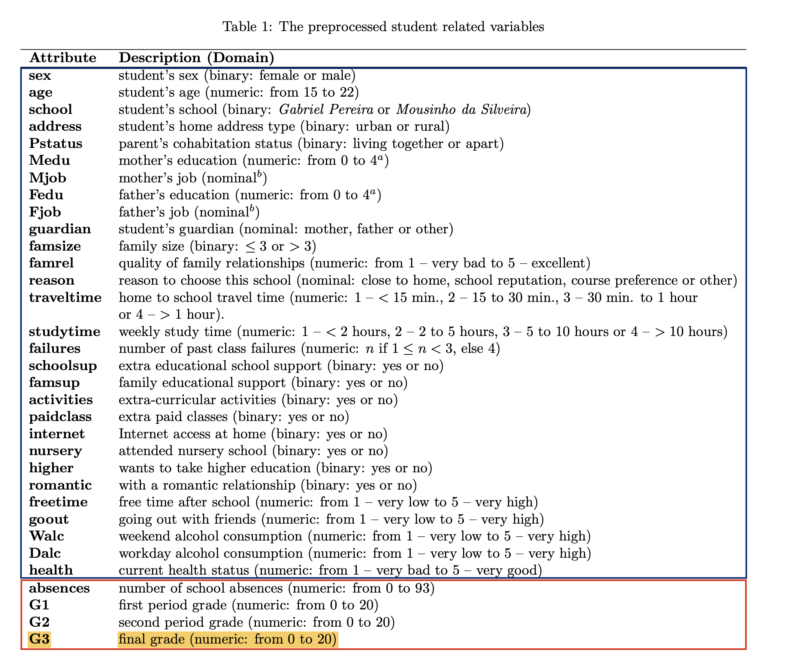

```{r setup, include = FALSE}
knitr::opts_chunk$set(echo = FALSE, 
                      warning = FALSE,
                      error = FALSE,
                      message = FALSE,
                      tidy = TRUE
                      #fig.width = 6, 
                      #fig.height = 6, 
                      #fig.align = "center",
                     )
#install.packages("gridExtra")
library(tidyverse)
library(ggfortify)
library(GGally)
library(sjPlot)
library(highcharter)
library(htmltools)
library(ggthemes)
library(gridExtra)
```

```{r setup_output, include=FALSE}
hook_output_def = knitr::knit_hooks$get('output')
knitr::knit_hooks$set(output = function(x, options) {
  if (!is.null(options$vspaceout)) {
    end <- paste0("\\vspace{", options$vspaceout, "}")
    stringr::str_c(hook_output_def(x, options), end)
  } else {
    hook_output_def(x, options)
  }
})
```

```{r data_cleaning}
#Load and transform data before presentation

#load data
dat_raw <- read.table("../data/student-por.csv",sep=";",header=TRUE) %>% select(-G1, -G2)
# glimpse(dat_raw)

#data into factors
#factor_columns <- names(dat_raw %>% select(-G3, -age, -absences))
factor_columns <- names(dat_raw %>% select(-G3, -age, -absences, -famrel, -traveltime, -studytime, -freetime, -goout, -Walc, -Dalc, -health, -failures, -Medu, -Fedu))

#factorise and log for absences
dat <- dat_raw %>% 
  mutate_at(factor_columns, as.factor) %>%
  mutate(log_absences = log(absences+1)) %>% 
  select(-absences)

#all numeric variables in the dataset
numeric_columns <- names(dat %>% select (G3, age, log_absences, studytime, freetime, failures, Medu))


#data with numeric varibles
dat_numeric <- dat %>% 
 select(all_of(numeric_columns))

model_full = lm(formula = G3 ~ ., data = dat)


#backward selection on all data
model_backward <- step(model_full, direction = "backward", trace = FALSE)


model_null = lm(G3 ~ 1, data = dat) # Null model

#forward selection on all data
model_forward <- step(model_null, scope = list(lower = model_null, upper = model_full), direction = "forward", trace = FALSE)
```

class: top, left, header_background

```{r xaringan, include=FALSE} 
options(htmltools.dir.version = FALSE)

# install the package
#install.packages("xaringanthemer")

# see slide on xaringanthemer
library(xaringanthemer)

style_mono_light(base_color = "#23395b",
                 header_background_padding = "0.5em",
                 header_background_content_padding_top = "5rem", 
                 header_h1_font_size = "1.75rem", 
                 header_h2_font_size = "1.3rem")
```

# Introduction 

## Context

- Life factors (For example: home life, distance from school) can play a large role in the academic success of a student

--

- Case study: observing the Portuguese school system in 2005-2006

    1. There is high drop out rate
    2. There is high failure rate of the national language (Portuguese)
    
--

## Goals

- Examine student performance and find the key variables which dramatically influence educational success

--

## Why do this?

--

- We can help improve the academic success of students in the academic realm which may improve quality of life. 

---
class: left, middle, header_background
# Data description

```{r, out.width = "70%", out.height="50%", fig.align='center'}
library(knitr)

```


---
class: left, top, header_background
# Full model assumptions

Linearity and Independence

- Below shows 6 of the 13 numerical variables
```{r echo=FALSE, fig.align='center', fig.width=10, fig.height=6}
# Create long data for lm
dat_numeric <- dat_numeric %>% 
  mutate(ID = row_number())

dat_long_vars_no_G3 <- dat_numeric %>%
  select(-G3) %>% 
  pivot_longer(
    !ID,
    names_to = "var",
    values_to = "val"
)

dat_long <- left_join(
  dat_numeric %>% select(ID, G3),
  dat_long_vars_no_G3,
  by = "ID"
) %>% select(-ID)

#check linearity for numerical variables
ggplot(dat_long, aes(x = val, y = G3)) +
  geom_point(colour = "white") +
  geom_smooth(method = "loess", se = FALSE) +
  facet_wrap(~var, ncol = 3, scales = "free_x")+ 
  theme_solarized(light = FALSE) +
  labs(colour = "white")


```

---
class: left, top, header_background
# Full model assumptions (cont.)

Heteroekedasticity and Normality

```{r echo=FALSE, fig.align='center', fig.width=12, fig.height=7}
#par(mfrow=c(1,2))
#plot for hetoerskedasticity
#plot(model_full, 1)

#Plot for normality 
#plot(model_full,2)

dtplot <- data.frame(
  fitted = model_full$fitted.values,
  Residuals = model_full$residuals
)
homo <- dtplot %>% ggplot()+
  aes(x=fitted, y = Residuals) +
  geom_point(colour = "white") +
  geom_smooth(method = "loess", se = FALSE) +
  theme_solarized(light = FALSE) +
  labs(colour = "white")


qq <- dtplot %>% ggplot() +
  aes(sample= Residuals)+
  geom_qq(colour = "white")+
  geom_qq_line(colour = "pink")+
  theme_solarized(light = FALSE) +
  labs(colour = "white")

grid.arrange(homo, qq, ncol=2)
```
---
class: left, top, header_background


# Stepwise selection

```{r, fig.height = 6, fig.height = 3}
options(highcharter.theme = hc_theme_smpl(tooltip = list(valueDecimals = 2)))

dt <- data.frame(
  step = gsub("\\- ", "", model_backward$anova$Step),
  AIC = model_backward$anova$AIC
)
dt$step[1] <- 'full'

hc_backward <- dt %>%
  hchart(
    'line', hcaes(x = step, y = AIC),
    name = "AIC"
  ) %>%
  hc_title(text = "Backward selection") %>% 
  hc_subtitle(text = "starts with full model") %>% 
  hc_add_theme(hc_theme_chalk()) %>% 
  hc_tooltip(pointFormat = '{point.x:} {point.y: .0f}') %>% 
  hc_xAxis(
    title = list(text = "Dropped variables"),
    labels = list(
      style = list(
              fontSize = '2.0em',    # 1.4 x the size of the default text
              color = "#7cb5ec"      # Hex code for the default blue
          )
      )
  )
  

dt <- data.frame(
  step = gsub("\\+ ", "", model_forward$anova$Step),
  AIC = model_forward$anova$AIC
)
dt$step[1] <- 'constant'

hc_forward <- dt %>%
  hchart(
    'line', hcaes(x = step, y = AIC),
    name = "AIC"
  ) %>%
  hc_title(text = "Forward selection") %>% 
  hc_subtitle(text = "starts with constant") %>% 
  hc_add_theme(hc_theme_chalk()) %>% 
  hc_tooltip(pointFormat = '{point.x:} {point.y: .0f}') %>% 
  hc_xAxis(
    title = list(text = "Added variables"),
    labels = list(
      style = list(
              
              fontSize = '2.0em',    # 1.4 x the size of the default text
              color = "#7cb5ec"      # Hex code for the default blue
          )
      )
  )


#https://stackoverflow.com/questions/35950710/htmlwidgets-side-by-side-in-html
browsable(
  tagList(list(
    tags$div(
      style = 'width:50%;display:block;float:left;',
      hc_backward
    ),
    tags$div(
      style = 'width:50%;display:block;float:left;',
      hc_forward
    )
  ))
) 
```
---
class: left, top, header_background

# Model comparison


```{r, results = "asis", echo = FALSE, message = FALSE, fig.align='center', vspaceout='5cm'}
library(knitr)

tex2markdown <- function(texstring) {
  writeLines(text = texstring,
             con = myfile <- tempfile(fileext = ".tex"))
  texfile <- pandoc(input = myfile, format = "html")
  cat(readLines(texfile), sep = "\n")
  unlink(c(myfile, texfile))
}

textable <- "

\\begin{table}[]
\\centering
\\caption{}
\\begin{tabular}{||c c c c c||} 
 \\hline
 name & Forward model & Backward model & Backward drop model & Forward add model \\\\
 \\hline\\hline
 R2 / R2 adjusted & 0.392 / 0.316 & 0.331 / 0.318 & 	0.327 / 0.316 & 	0.331 / 0.317 \\\\ 
 \\hline
 AIC & 3131.886 & 3131.577 & 3131.718 & 3132.001 \\\\ 
 \\hline
\\end{tabular}
\\end{table}
"

tex2markdown(textable)
```
- Backward model vs Backward drop model

- Forward model vs Forward add model

- Backward model vs Forward model
---
class: left, top, header_background


# Final model - assumptions
Hteroskedasticity and Normality
```{r, fig.width=12, fig.height=7}
dtplot2 <- data.frame(
  fitted = model_backward$fitted.values,
  Residuals = model_backward$residuals
)
homo2 <- dtplot2 %>% ggplot()+
  aes(x=fitted, y = Residuals) +
  geom_point(colour = "white") +
  geom_smooth(method = "loess", se = FALSE) +
  theme_solarized(light = FALSE) +
  labs(colour = "white")


qq2 <- dtplot %>% ggplot() +
  aes(sample= Residuals)+
  geom_qq(colour = "white")+
  geom_qq_line(colour = "pink")+
  theme_solarized(light = FALSE) +
  labs(colour = "white")

grid.arrange(homo2, qq2, ncol=2)
```

---
class: left, top, header_background
# Coefficient interpretation

**Grade = 8.84 + (-1.50) failures + (-1.43) schoolMS + (1.90) higheryew + (0.43) studytime + (-1.31) schoolsupyes + (-0.39) Dalc + (-0.17) health + (-0.55) sexM + (-0.44) romenticyes + (0.16) age + (0.30) Medu + (-0.47) guardianMother + (-0.04) guardianOther**


- One unit increase in failure -->  a 1.5 unit **decrease** in grade.


- One unit increase in health -->  a 0.17 unit **decrease** in grade.


- A level increase in mother education -->  a 0.30 unit **increase** in grade.


---
class: left, top, header_background
# Conclusion

- 31.5% of the observed variation in the final grade is explained by our linear model.

- The analysis demonstrated that the number of past failures is the most significant predictor.

- We can conclude that there are other factors (social and familial) that could influence the students academic performance and which could be targeted to decrease failure rates.

## Limitations
- More complicated methods  such as random forest, neural networks or decision tree could potentially produce better results can be used.
- Used data on only 2 particular schools which can produce quite specific results.
- There is possibility for potential overfitting as we didn’t use out of sample performance for model selection.

---

class: left, top, header_background

# References
```{r, load_refs, echo=FALSE}
# install.packages("RefManageR")
# install.packages("bibtex")
library(RefManageR)
library(bibtex)
bib <- ReadBib("../bibliography/bibliography.bib", check = FALSE)
ui <- "- "
```

```{r, print_refs, results='asis', echo=FALSE, warning=FALSE, message=FALSE}
writeLines(ui)
print(bib[key = "eurostat"], 
  .opts = list(check.entries = FALSE, 
               style = "html", 
               bib.style = "authoryear"))

```

- _Cortez, P., & Silva, A. M. G. (2008). Using data mining to predict secondary school student performance. http://www3.dsi.uminho.pt/pcortez/student.pdf. Accessed 2021-10-20_

```{r, results='asis', echo=FALSE, warning=FALSE, message=FALSE}
writeLines(ui)
print(bib[key = "dummy_r"], 
  .opts = list(check.entries = FALSE, 
               style = "html", 
               bib.style = "authoryear"))

```

```{r, results='asis', echo=FALSE, warning=FALSE, message=FALSE}
writeLines(ui)
print(bib[key = "beginners_guide"], 
  .opts = list(check.entries = FALSE, 
               style = "html", 
               bib.style = "authoryear"))

```
